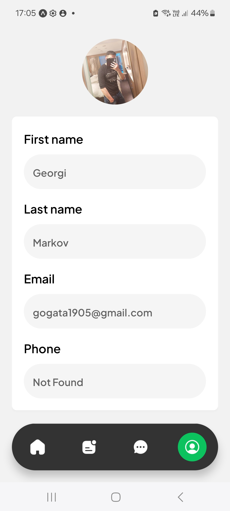
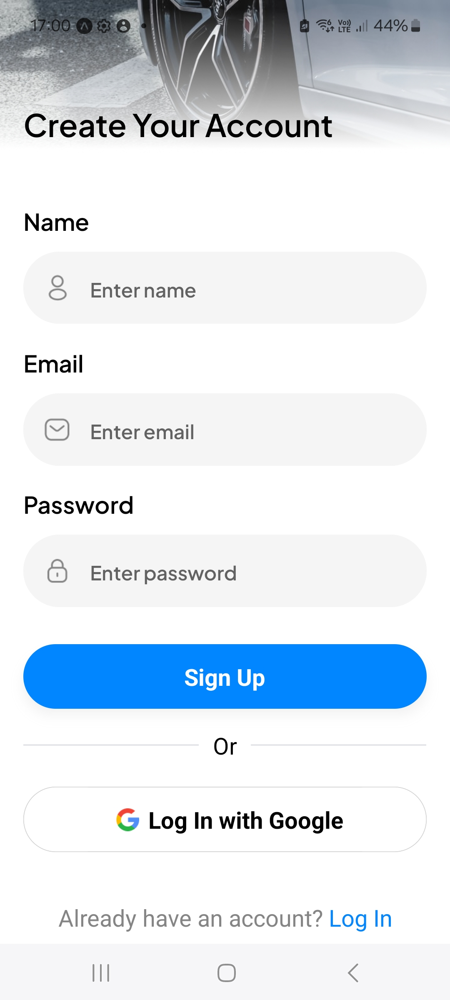
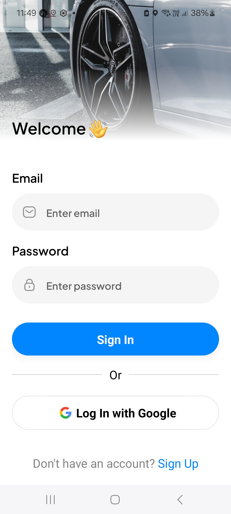

Uber-React_Native-Project-002

# Uber-React_Native

## Introduction

Uber is an application for ordering an uber.

## Features

- React Native
- Expo
- Stripe
- PostgreSQL
- Google Maps
- Zustand
- Clerk
- Tailwind CSS

## <a name="quick-start">🤸 How to use?</a>

Follow these steps to set up the project locally on your machine.

**Prerequisites**

Make sure you have the following installed on your machine:

- [Git](https://git-scm.com/)
- [Node.js](https://nodejs.org/en)
- [npm](https://www.npmjs.com/) (Node Package Manager)

**Cloning the Repository**

```bash
git clone https://github.com/gogata05/Uber-React_Native-Project-002.git
cd uber
```

**Installation**

Install the project dependencies using npm:

```bash
npm install
```

**Set Up Environment Variables**

Create a new file named `.env` in the root of your project and add the following content:

```env
EXPO_PUBLIC_CLERK_PUBLISHABLE_KEY=

EXPO_PUBLIC_PLACES_API_KEY=
EXPO_PUBLIC_DIRECTIONS_API_KEY=

DATABASE_URL=

EXPO_PUBLIC_SERVER_URL=https://uber.dev/

EXPO_PUBLIC_GEOAPIFY_API_KEY=

EXPO_PUBLIC_STRIPE_PUBLISHABLE_KEY=
STRIPE_SECRET_KEY=
```

Replace the placeholder values with your actual Clerk, Stripe, NeonDB, Google Maps, andgeoapify credentials. You can
obtain these credentials by signing up on
the [Clerk](https://clerk.com/), [Stripe](https://stripe.com/in), [NeonDB](https://neon.tech/), [Google Maps](https://console.cloud.google.com/)
and [geoapify](https://www.geoapify.com/) websites respectively.

**Running the Project**

```bash
npx expo start
```

Download the [Expo Go](https://expo.dev/go) app and Scan the QR code on your respective device to view the project.

# Photos

## 1. Get Started Page


## 2. Sign in with Google


## 3. Choose a Rider - Google Maps


## 4. Rider Details


## 5. Stripe Payment


## 6. Recent Rides 1


## 7. All Rides


## 8. From To Ride


## 9. Recent Rides 2


## 10. Access location


## 11. Enter Verification Code


## 12. Email Verification Code - using Clear Auth


## 13. Search Destination - With Google Places API


## 14. Profile



## 15. Messages


## 16. Register



## 17. Login



## 18. Login


## 19. NeonDB PostgreSQL


## 20. Clerk Authentication


