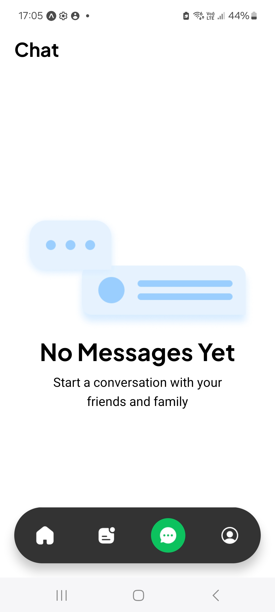

# Screenshots

## 1. Get Started Page

## 2. Sign in with Google

## 3. Choose a Rider - Google Maps

## 4. Rider Details

## 5. Stripe Payment

## 6. Recent Rides 1

## 7. All Rides

## 8. From To Ride

## 9. Recent Rides 2

## 10. Access location

## 11. Enter Verification Code

## 12. Email Verification Code - using Clear Auth

## 13. Search Destination - With Google Places API

## 14. Profile

## 15. Messages

## 16. Register

## 17. Login

## 18. Login

## 19. NeonDB PostgreSQL

## 20. Clerk Authentication

